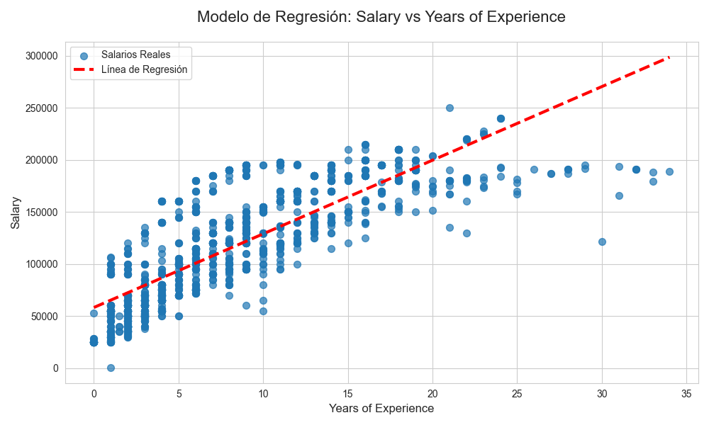

# Data Salary Analysis

[](https://kedro.org)

## Visión General

Este proyecto Kedro implementa un pipeline de ciencia de datos de extremo a extremo para analizar la relación entre los años de experiencia y el salario. La solución ingiere un conjunto de datos crudos, lo procesa para garantizar su calidad, entrena un modelo de regresión lineal para predecir salarios y, finalmente, evalúa y visualiza el rendimiento del modelo.

El objetivo es demostrar un flujo de trabajo de Machine Learning estructurado y reproducible, donde cada paso, desde la limpieza de datos hasta la generación de reportes, está encapsulado en un pipeline modular y robusto.

---

## Estructura del Proyecto

El proyecto se organiza en los siguientes pipelines principales:

*   **`data_processing`**: Se enfoca en la limpieza y preparación inicial de los datos. Toma el `Salary_Data.csv` crudo, elimina filas con valores nulos y lo guarda como un archivo intermedio (`cleaned_salary_data.xlsx`), listo para el modelado.
*   **`data_science`**: Contiene la lógica de Machine Learning. Este pipeline:
    *   Divide los datos limpios en conjuntos de entrenamiento y prueba (80/20).
    *   Entrena un modelo de `LinearRegression` de scikit-learn utilizando los datos de entrenamiento.
    *   Evalúa el modelo calculando su coeficiente de determinación (R²).
    *   Guarda el modelo entrenado (`regressor.pkl`) para su uso futuro.
*   **`reporting`**: Se encarga de la visualización de resultados. Carga el modelo entrenado y los datos de prueba para generar una gráfica que compara los salarios reales con la línea de regresión predicha por el modelo, guardándola como `regression_plot.png`.

---

## Resultados y Visualización

El dataset final procesado se utiliza como fuente de datos para un dashboard interactivo en Power BI, que resume los hallazgos clave del análisis.

[**Ver Dashboard de Salarios en Power BI**](https://app.powerbi.com/view?r=eyJrIjoiNGE1ZGMwMTItYjVhNS00NWEwLTgyNDItZjkyYTBhOTUyY2M2IiwidCI6ImRmNGI2MzcyLWEwM2EtNDZmMC05YmY1LTdmOGQzNzhhMzMzNCIsImMiOjR9)

### Principales Hallazgos del Dashboard

*   **Volumen de Datos:** El análisis se basa en un conjunto de **6,698 registros** de profesionales de diversas áreas.
*   **Influencia de la Educación:** Se observa una correlación directa entre el nivel educativo y el salario promedio, donde los profesionales con **doctorado (PhD)** alcanzan la remuneración más alta.
*   **Brecha Salarial de Género:** Aunque la distribución de género en la muestra es relativamente pareja (55% hombres, 45% mujeres), el salario promedio de los hombres es superior al de las mujeres en el conjunto de datos analizado.
*   **Cargos de Alta Gerencia:** Los roles ejecutivos como **CEO, CTO y Chief Data Officer** se posicionan como los mejor remunerados, superando significativamente a otros puestos.
*   **Experiencia vs. Edad:** El análisis visual confirma una clara correlación positiva entre la edad, los años de experiencia y el salario, mostrando una progresión salarial a lo largo de la carrera profesional.

---

### Rendimiento del Modelo

*   **Coeficiente de Determinación (R²)**: **0.66**. Esto indica que el modelo puede explicar aproximadamente el 66% de la variabilidad en los salarios basándose en los años de experiencia.
*   **Fórmula de Regresión**: `Salario ≈ 7821.49 * Años de Experiencia + 36239.95`

### Gráfica de Regresión

La siguiente gráfica muestra los salarios reales del conjunto de prueba (puntos azules) y la línea de predicción del modelo (línea roja discontinua).



La visualización confirma una clara correlación positiva: a medida que aumentan los años de experiencia, también lo hace el salario. La línea de regresión muestra el ajuste del modelo a esta tendencia.

---

## Instalación y Ejecución

Sigue estos pasos para configurar y ejecutar el proyecto en tu máquina local.

### 1. Clonar el Repositorio

Primero, clona este repositorio en tu máquina.

```bash
git clone https://github.com/J-Lopez-IICG/DataSalaryKedro.git
cd DataSalaryKedro
```

### 2. Crear y Activar un Entorno Virtual

Es una práctica recomendada utilizar un entorno virtual para aislar las dependencias del proyecto.

```bash
# Crear el entorno virtual
python -m venv venv

# Activar en Windows (PowerShell)
.\venv\Scripts\Activate.ps1

# Activar en macOS/Linux
# source venv/bin/activate
```

### 3. Instalar Dependencias

Una vez que el entorno virtual esté activado, instala todas las librerías necesarias.

```bash
pip install -r requirements.txt
```

### 4. Ejecutar el Pipeline

Con las dependencias instaladas, puedes ejecutar el pipeline completo con un solo comando.

```bash
kedro run
```

Esto ejecutará todos los nodos en secuencia, generando los datos limpios, el modelo entrenado y la gráfica de resultados en la carpeta `data/`.

---

## Desarrollo con Notebooks

La carpeta `notebooks` contiene los Jupyter Notebooks utilizados durante la fase de exploración y desarrollo.

Para trabajar con ellos de forma interactiva dentro del contexto de Kedro, ejecuta:

```bash
kedro jupyter lab
# o también
kedro jupyter notebook
```

> **Nota**: Al usar estos comandos, Kedro inicia el notebook con las variables `context`, `session`, `catalog` y `pipelines` ya cargadas, facilitando la interacción con los datos y funciones del proyecto.

## Reglas y Directrices

*   No elimines ninguna línea del archivo `.gitignore`.
*   No subas datos al repositorio (la carpeta `data/` está ignorada por defecto).
*   No subas credenciales o configuraciones locales. Mantenlas en la carpeta `conf/local/`.
